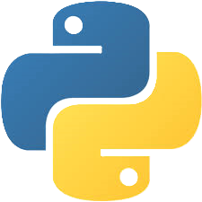
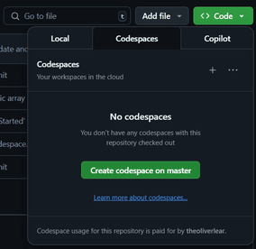

# Python Unleashed
### A versatile language demystified.



---

Python Unleashed is a repository designed to show you the power of Python. It
is a coveted language from systems programming, to web development, to data
science. This repository will show you the powerful abilities of Python and
how to use them.

---

# Powerful Data Science

## Get Started

### Easiest Option

You can create a GitHub Codespace under the green Code button. This will
create an IDE for you in the browser.

#### Create a Codespace with Code Button



#### Load the Codespace Environment

```bash
bash ./init_codespace.sh
```

```bash
source ~/.bashrc
```

### Most Customizable Option


### Run the Python Code

---

## Table of Contents

---

### Chapter 0: Introduction

- What is Python?
    - Python is a high-level language that is easy to read and easy to use.
Python allows you to write code that is platform independent, concise, and
easy to maintain.
- Why Python?
    - Python's syntax is allows you to write code at a high velocity. More
importantly, Python is rich in libraries, allowing you to do almost anything
programmatically.
- What is an interpreted language?
    - Python is an interpreted language, meaning that it is not compiled into
machine code ahead of time. Instead, Python code is executed line by line at
runtime.
---

### Chapter 1: Python 101
- Syntax
- Installing Dependencies

### Chapter 2: Data Science 101
- Jupyter Notebooks
- Pandas, NumPy, and Matplotlib
- Data Storage
  - Text
  - CSV
  - SQL

### Chapter 3: Cleaning Data
- Link to Dataset
- Link to Notebook

---

## _Exercise One: Cleaning Up Survey Results_
- Link to Dataset
- Link to Notebook

---

### Chapter 4: Analyzing Data
- Link to Dataset
- Link to Notebook

---

## _Exercise Two: Explain Profits and Losses_
- Link to Dataset
- Link to Notebook

---

### Chapter 5: Plotting Data
- Link to Dataset
- Link to Notebook

---

## _Exercise Three: Visualize Data Science Salaries_
- Link to Dataset
- Link to Notebook

---

### Chapter 6: Machine Learning 101
- What is Machine Learning?
- What is an epoch?
- What is batch size?
- What is loss?
- What is a learning rate?

### Chapter 7: Machine Learning with TensorFlow
- Link to Dataset
- Link to Notebook

---

## _Exercise Four: Predict Stock Market_
- Link to Dataset
- Link to Notebook

---

## Congrats!
You have completed the Python Unleashed repository. You can now use Python for
almost any programming task. With your new knowledge of Python, you can take
the computer science world by storm!