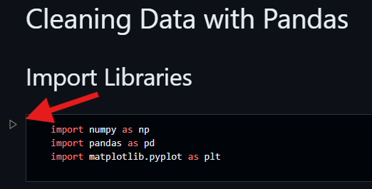
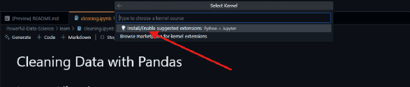
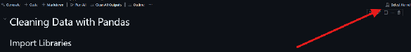
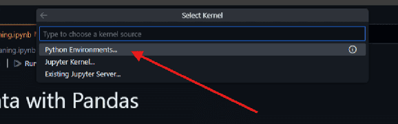
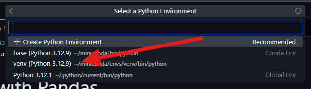

# Python Unleashed
### A versatile language demystified.


---

Python Unleashed is a repository designed to show you the power of Python. It
is a coveted language from systems programming, to web development, to data
science. This repository will show you the powerful abilities of Python and
how to use them.

---

# Powerful Data Science

## Get Started

You can create a GitHub Codespace under the green Code button. This will
create an IDE for you in the browser.

### Create a Codespace with Code Button


### Load the Codespace Environment

```bash
cd Powerful-Data-Science
```

```bash
bash ./init_codespace.sh
```

---

### Setup Codespace Visual Studio Code

#### 1. Click the Play Button in Any Jupyter Notebook



#### 2. Click the Install Option for Python and Jupyter



#### 3. After Installation, Select a Kernel



#### 4. Click `Python Environments` Option



#### 5. Select the `venv` Environment

'

## Table of Contents

---

### Chapter 0: Introduction

- What is Python?
    - Python is a high-level language that is easy to read and easy to use.
Python allows you to write code that is platform independent, concise, and
easy to maintain.
- Why Python?
    - Python's syntax is allows you to write code at a high velocity. More
importantly, Python is rich in libraries, allowing you to do almost anything
programmatically.
- What is an interpreted language?
    - Python is an interpreted language, meaning that it is not compiled into
machine code ahead of time. Instead, Python code is executed line by line at
runtime.
---

### Chapter 1: Python 101
- Syntax
- Installing Dependencies

### Chapter 2: Data Science 101
- What is a DataFrame?
  - A way of representing data in code as a table format. It allows for a 
separation of data and code for the integrity of the data.
- Jupyter Notebooks
- Pandas, NumPy, and Matplotlib
- Data Storage
  - Text
  - CSV
  - SQL Database

### Chapter 3: Cleaning Data
- [Messy Dataset](./Powerful-Data-Science/datasets/student_mental_health.csv)
- [Clean Dataset](./Powerful-Data-Science/datasets/updated/student_mental_health.csv)
- [Notebook](./Powerful-Data-Science/learn/cleaning.ipynb)

---

## _Exercise One: Cleaning Up Survey Results_
- [Dataset](./Powerful-Data-Science/datasets/exercise/employment_survey.csv)
- [Notebook](./Powerful-Data-Science/exercise/cleaning_exercise.ipynb)

---

### Chapter 4: Analyzing Data
- [Dataset](./Powerful-Data-Science/datasets/updated/student_mental_health.csv)
- [Notebook](./Powerful-Data-Science/learn/analysis.ipynb)

---

## _Exercise Two: Analyze the Data Science Job Market_
- [Dataset](./Powerful-Data-Science/datasets/exercise/ds_salaries.csv)
- [Notebook](./Powerful-Data-Science/exercise/analysis_exercise.ipynb)

---

### Chapter 5: Plotting Data
- [Dow Jones Dataset](./Powerful-Data-Science/datasets/dow_jones.csv)
- [Student Mental Health Dataset](./Powerful-Data-Science/datasets/updated/student_mental_health.csv)
- [Notebook](./Powerful-Data-Science/learn/plotting.ipynb)

---

## _Exercise Three: Visualize Data Science Salaries_
- [Dataset](./Powerful-Data-Science/datasets/exercise/ds_salaries.csv)
- [Notebook](./Powerful-Data-Science/exercise/plotting_exercise.ipynb)

---

### Chapter 6: Machine Learning 101
- What is Machine Learning?
  - Machine learning is a subset of artificial intelligence that allows
computers to learn from data **without being explicitly programmed**.
- What is an epoch?
  - An epoch is one complete pass through the training data.
- What is batch size?
  - Batch size is the number of samples that are used in one iteration of
training before updating the model weights.
- What is loss?
  - Loss is a measure of how well the model is performing. It is a
function that takes the predicted values and the actual values and returns a
number that represents how far off the predicted values are from the actual.
- What is an optimizer?
  - An optimizer is an algorithm that is used to minimize the loss function.
- What is a learning rate?

### Chapter 7: Machine Learning with TensorFlow
- [Dataset](./Powerful-Data-Science/datasets/dow_jones.csv)
- [Notebook](./Powerful-Data-Science/learn/machine_learning.ipynb)

---

## _Exercise Four: Predict Bitcoin Price_
- [Dataset](./Powerful-Data-Science/datasets/exercise/bitcoin_price.csv)
- [Notebook](./Powerful-Data-Science/exercise/machine_learning_exercise.ipynb)

---

## Congrats!
You have completed the Python Unleashed repository. You can now use Python for
almost any programming task. With your new knowledge of Python, you can take
the computer science world by storm!